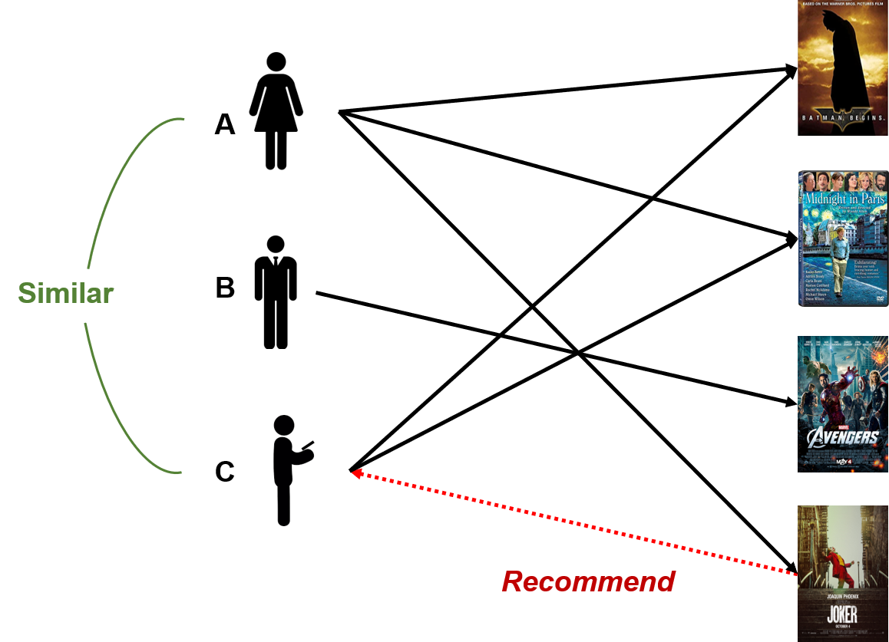

# Recommender System-

+ Recommender System is a system that seeks to predict or filter preferences according to the user’s choices. 
  Recommender systems are utilized in a variety of areas including     movies, music, news, books, research articles,
  search queries, social tags, and products in general.

+  A Recommender System is one of the most famous applications of data science and machine learning.

# Types

+ Collaborative filtering: Collaborative filtering approaches build a model from user’s past behavior
(i.e. items purchased or searched by the user) as well as similar decisions     made by other users. 
This model is then used to predict items (or ratings for items) that user may have an interest in.

+ Content-based filtering: Content-based filtering approaches uses a series of discrete characteristics 
  of an item in order to recommend additional items with similar properties. Content-based filtering methods 
  are totally based on a description of the item and a profile of the user’s preferences. It recommends items 
  based on user’s past preferences.

