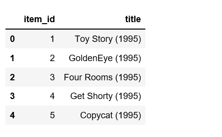
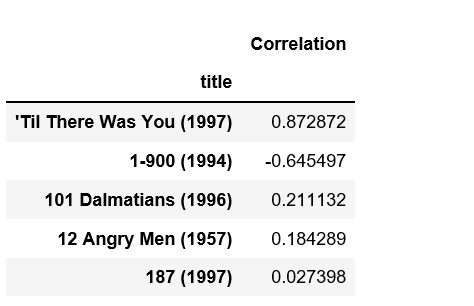
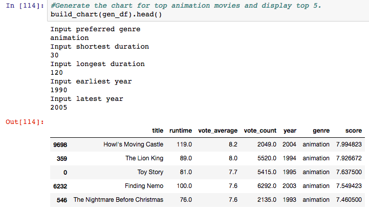
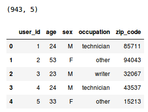

# Try to learn

# Recommender System-

+ Recommender System is a system that seeks to predict or filter preferences according to the user’s choices. 
  Recommender systems are utilized in a variety of areas including     movies, music, news, books, research articles,
  search queries, social tags, and products in general.

+  A Recommender System is one of the most famous applications of data science and machine learning.

# Types

+ Collaborative filtering: Collaborative filtering approaches build a model from user’s past behavior
(i.e. items purchased or searched by the user) as well as similar decisions     made by other users. 
This model is then used to predict items (or ratings for items) that user may have an interest in.

+ Content-based filtering: Content-based filtering approaches uses a series of discrete characteristics 
  of an item in order to recommend additional items with similar properties. Content-based filtering methods 
  are totally based on a description of the item and a profile of the user’s preferences. It recommends items 
  based on user’s past preferences.
  
+ Demographic Filtering- They offer generalized recommendations to every user, based on movie popularity and/or genre.
  The System recommends the same movies to users with        similar demographic features. Since each user is different 
  this approach is considered to be too simple. The basic idea behind this system is that movies that are more popular 
  and critically acclaimed will have a higher probability of being liked by the average audience.
  
 # Tools 
 
 + Python
 + Juypter Notebook
 + Pandas
 + Matplotlib
 + Numpy
  
# Code-

# Link-https://www.linkedin.com/in/abhishek-singh-771291170/

# Thanks..... 
